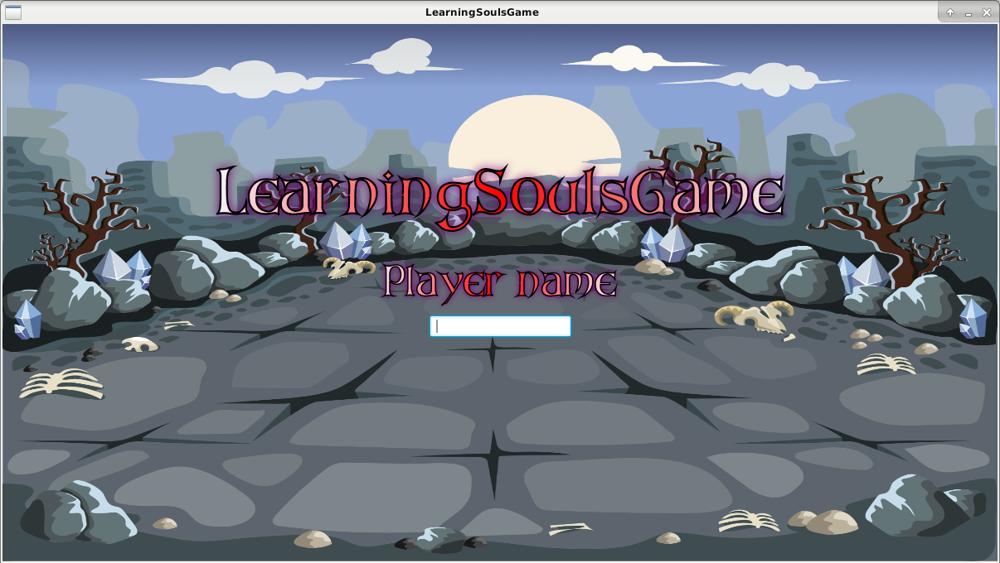

# Learning Souls Game

## Description

L'application est un jeu vidéo de type RPG. Elle a était développé durant la troisième année de ma **Licence
 Informatique** dans le cadre d'un module universitaire intitulé **Programmation Orientée Objet**
encadré par Gregory Bourguin maitre de conférence à L'Université du Littoral Côte d'Opale.

L'objectif du projet était de développer une application en utilisant les principes de la programmation Orientée Objet 
(classe, héritage, encapsulation, polymorphisme, évènement, écouteurs, observable).

### Dérouler

* Lorsque le jeu est lancé, le joueur contrôle un héro avec différents attributs et compétences.
* Le joueur affronte des zombies les uns à la suite des autres.
* Le joueur dispose (Pour l'instant) des capacitées d'attaques, récuperer, consommer.
    * attaque: le joueur utilise son arme pour attaquer, consomme de la **stamina** pour être exécuté
    * récupérer: le joueur regagne une portion de sa **stamina**
    * consommer: le joueur consomme le consommable équipé
* Lorsque le joueur effectue une action c'est au tour de l'ennemi d'attaquer puis à nouveau au joueur
* Lorsqu'un ennemi meurt, un autre apparait à la suite et ceci de manière infinie
* L'objectif pour le joueur est de survivre le plus longtemps possible et d'abattre un maxium d'ennemi tout en 
surveillant ses caractéristique (**point de vie**, **stamina**)

### Images




### Fonctionnalitées

#### Fait

* Développer l'engine du jeu
    * Création des personnages & leurs caractéristiques
	* Création des ressources (armes, consommables, equipements)
	* Création des compétences
	* Gestion des exceptions
	* Définition du système de combat
* Développement de l'interface graphiques
    * Création des différentes layers
	* Animation des personnages
	* Représentation graphiques des ressources
	* Création et gestion des évènements
	* Gestion des interactions

#### En cours

* Leveling des personnages: Plus le joueur abat d'ennemi, plus leur difficulté doit être élevé et plus le joueur doit
pouvoir rivaliser avec eux (augmentation caractéristique).

* Système de drop: Lorsqu'un ennemi est battu il a une probabilité de générer un sac de **loot** que le joueur peut récupérer et équiper
    * si un loot est générer, une fenêtre s'ouvre avec les objets disponibles
    * Le joueur choisie les objets qu'il souhaite dans la limite de la taille de son inventaire

#### À faire / Souhaitées (Idées)

* Système d'état: les ennemies doivent avoir une autre capacité (en plus de l'attaque) qui affecte l'état du joueur 
(confus, empoisonné)
* Avoir accès à l'inventaire et gérer son equipement (nouvelle compétence)
* Afficher l'équipement du personnage à côté de ses caractéristiques
* Élargir le bestiaire, les équipements, ressources
* Mettre en place des récompenses pour le joueur lorsque certains seuils sont atteints:
    * Badges, ornements autour du médaillon du joueur
    * Changer de background

## Utilisation

### Dépendances

Version de Java >= 8.0 (Afin d'avoir JavaFX inclus dans la JVM)

| Environnement Technique | |
| -------------: | :------------- |
| **Langage**  | Java  |
| **Technologie**  | JavaFX |
| **Normes & architectures** | POO |

### Installation
````
git clone "nom du depot"
````
### Lancement (run)

Le jeu peut se lancer de deux manière différentes:
* Interface graphique: exécuter la classe *LearningSoulsGame*
* Ligne de commande: exécuter la classe *LearningSoulsGameApplication*

### À savoir

Les équipements, background et ressources utilise des images disponibles gratuitement sur:
* [craftpix.net](https://craftpix.net/)
* [super game assets](https://www.supergameasset.com/)
